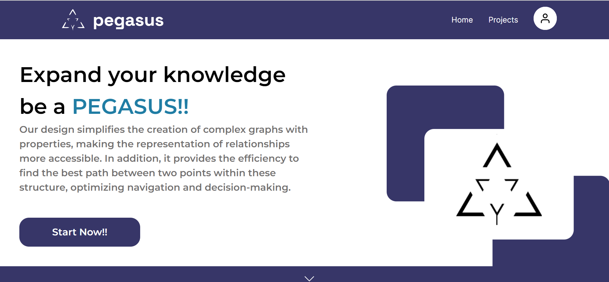

# Introdução
Este artigo se concentra em um desafio específico relacionado à automação de rotas industriais, com destaque para a necessidade de desenvolver soluções que sejam tanto flexíveis quanto eficazes na definição e programação dessas rotas. Utilizando como estudo de caso a área de adegas em uma cervejaria, examinaremos as complexidades inerentes à transferência de cerveja fermentada para tanques de maturação. Ao longo deste artigo, exploraremos como abordagens inovadoras podem aprimorar a otimização dessas rotas, considerando elementos como o layout da planta, a configuração dos tanques, a programação das rotas nos controladores lógicos programáveis (CLPs) e muito mais.

O problema recorrente na indústria está relacionado com a rigidez e ineficiência das soluções atuais para a automação de rotas. A complexidade aumenta exponencialmente à medida que mais tanques são adicionados, tornando o sistema difícil de gerir e adaptar.
Atualmente, a solução de automação industrial voltada à definição de rotas é inflexível, requerendo um esforço considerável de programação sempre que ocorre uma mudança na disposição dos equipamentos ou uma nova configuração de produção. Esse problema é especialmente exacerbado em setores como o de produção de bebidas, onde a transferência de líquidos entre diferentes tanques se torna uma etapa crítica e repetitiva. Tome-se como exemplo uma adega em uma cervejaria, onde a transferência de cerveja fermentada para os tanques de maturação pode resultar em centenas de rotas possíveis, dependendo da disposição dos tanques, capacidades, entre outros fatores. 

Dessa forma, a relevância desse problema é ancorada na busca incessante por maior eficiência, economia de recursos e redução de tempos ociosos nas operações industriais. Soluções flexíveis para a definição de rotas não apenas agilizam a reconfiguração dos processos de produção, mas também permitem uma adaptação mais fácil às mudanças nas demandas do mercado ou à disponibilidade de recursos. Além disso, a minimização de erros na definição das rotas pode conduzir a melhorias substanciais na qualidade do produto final e na segurança das operações.

O trabalho em curso, em colaboração com a Rockwell Automation, uma empresa global de automação industrial, visa endereçar essa lacuna na automação de rotas industriais, com um foco em uma abordagem modular e flexível baseada na modelagem de grafos. A modelagem de grafos é uma estrutura matemática que permite representar as conexões entre entidades de maneira clara e eficiente. Nossa abordagem envolve a representação de tanques, tubulações e pontos de transferência como nós do grafo, enquanto as rotas possíveis são representadas pelas arestas.

Por meio dessa representação, planejamos desenvolver um algoritmo de otimização que identifica as rotas possíveis para a transferência de líquidos entre diferentes pontos na adega da cervejaria. A modularidade da abordagem permitirá sua adaptação a diferentes configurações de produção, sem a necessidade de reescrever todo o sistema. Isso resultará em um procedimento padronizado para a definição de rotas em ambientes de automação industrial, reduzindo significativamente o esforço de engenharia necessário para cada novo projeto. Dessa forma, a solução deve gerar as rotas que serão utilizadas na programação
do Controlador lógico programável (CLP), presente em toda fábrica automatizada.

Utilizaremos o programa Neo4J para modelar os grafos e dois bancos de dados para armazenar todas as informações referentes à pesquisa. O primeiro banco de dados estará no próprio Neo4J e o segundo bancos de dados é o MySQL. Para resolver o problema de encontro das rotas, utilizaremos o algoritmo Backtracking e logo depois validaremos a ideia. O desenvolvimeto do projeto dependerá dos feedbacks do parceiro durante os encontros de validação no final das sprints e também dependerá do entendimento refinado do problema, após a primeira modelagem. Dessa forma, adotaremos um método iterativo para a resolução desse problema.

# Motivação

A automação industrial desempenha um papel crucial na eficiência e na produtividade dos sistemas de manufatura modernos. A gestão eficaz das rotas de fluxo de materiais e processos é uma preocupação vital para indústrias que dependem de uma série de tanques, tubulações e válvulas interconectadas para a produção. A Rockwell Automation, líder global em automação industrial, destaca um problema prático e desafiador na gestão de rotas em indústrias como as cervejarias: a complexidade e a inflexibilidade dos sistemas atuais para adaptar-se a novas configurações e a necessidade de otimização para garantir um fluxo eficiente e eficaz.

Na produção de cerveja, por exemplo, as fases de fermentação e maturação envolvem um alto grau de complexidade nas operações de roteamento. A transferência de produtos entre diferentes tanques não é apenas uma questão de abertura e fechamento de válvulas. Cada etapa exige um controle preciso e considerações sobre o tempo de fermentação, maturação e vários outros parâmetros. Em uma única "adega" com múltiplos tanques de fermentação e maturação, o número de rotas possíveis pode chegar a centenas, cada uma exigindo um conjunto único de operações e controles.

Dada essa complexidade, soluções existentes muitas vezes resultam em esforços significativos de programação e engenharia para cada nova alteração ou configuração. Esse problema se torna ainda mais intrincado à medida que aumentamos a escala e a variedade de produtos fabricados. Com tamanha complexidade e variabilidade, as soluções atuais são não apenas custosas, mas também susceptíveis a erros, que podem resultar em atrasos na produção, perda de material ou até mesmo falhas catastróficas.

Portanto, a principal motivação deste artigo é explorar uma abordagem inovadora para resolver esse problema prático por meio da modelagem em grafos e otimização algorítmica. Esta abordagem não apenas promete tornar o processo de definição de rotas mais eficiente, mas também flexível e reutilizável. Ao implementar um algoritmo de alta performance que pode acomodar uma variedade de regras de origem e destino, juntamente com informações sobre a distribuição de tanques, válvulas e tubulações, pretendemos desenvolver uma solução robusta e escalável que pode levar a significativas economias de tempo e recursos para indústrias com necessidades complexas de roteamento.

# Metodologias do Projeto

1. Fase de Descoberta e Análise

Revisão Bibliográfica: Revisão da literatura atual em automação industrial, otimização de rotas e modelagem de grafos, para entender o estado da arte e os métodos existentes.

Entrevistas com Stakeholders: Discussões com engenheiros de processo, técnicos de automação e gestores de projeto para entender os desafios práticos e as expectativas do sistema.

Análise de Requisitos: Definição de requisitos funcionais e não-funcionais, em colaboração com os stakeholders.

2. Fase de Modelagem

Definição de Esquemas: Utilização de esquemas de P&ID fornecidos para entender a configuração atual dos tanques, tubulações e válvulas.

Modelagem em Grafos: Criação de um modelo de grafo para representar os elementos e rotas possíveis, seguindo a teoria dos grafos.

3. Fase de Desenvolvimento

Prototipagem: Desenvolvimento de um Protótipo de Mínimo Produto Viável (MVP) que implementa a modelagem em grafos.

Implementação de Algoritmos: Desenvolvimento e implementação de algoritmos para encontrar as rotas mais eficientes, com base na modelagem de grafos.

Interface do Usuário: Criação de uma interface de usuário simples que permite a importação e exportação de dados tabulares (ex.: CSV).

4. Fase de Teste e Validação

Testes Unitários: Realização de testes unitários para garantir que cada componente do sistema funcione como esperado.

Validação com Usuários: Involvimento de técnicos e engenheiros da equipe de automação na validação do sistema, através de simulações ou aplicação em um ambiente controlado.

Avaliação de Performance: Medição dos tempos de execução e eficiência do algoritmo em diferentes cenários e escalas.

5. Fase de Implantação

Treinamento de Usuários: Oferecimento de treinamento para os usuários finais sobre como utilizar a nova ferramenta.

Documentação: Desenvolvimento de documentação abrangente, incluindo manuais do usuário e documentação técnica.

Lançamento: Implantação da solução na infraestrutura existente, seguindo as melhores práticas de DevOps.

# Resultado da pesquisa em fontes científicas sobre o assunto / problema

## 1° Pesquisa relevante: Busca de Melhor Caminho entre Múltiplas Origens e Múltiplos Destinos
Considerando que dado uma origem, existem algumas opções de destino no processo de fabricação de um produto, é válido estudar algoritmos e modelagens que exploram diferentes opções de origens e diferentes opções de destino. 
Ademais, a questão de encontrar o melhor caminho em redes complexas, especialmente em ambientes urbanos como sistemas de transporte público, tem sido um foco significativo na pesquisa científica. Isso também tem implicações no contexto industrial, onde múltiplas origens e destinos estão envolvidos no processo de fabricação.

### Artigo Referenciado

**Título**: Busca de melhor caminho entre múltiplas origens e múltiplos destinos em redes complexas que representam cidades.  
**Autor**: Daniel Aragão Abreu Filho.

### Principais Achados

O artigo aborda uma estratégia inovadora de colapsar vértices para realizar apenas uma busca, o que reduz significativamente o tempo de execução do algoritmo. Essa abordagem foi testada na rede de ônibus de Fortaleza e mostrou resultados promissores.

#### Extensibilidade e Aplicação em Diferentes Cenários

Os resultados deste estudo sugerem que a estratégia de colapsar vértices pode ser aplicada em redes de diferentes tamanhos e complexidades. A pesquisa conseguiu estender os resultados obtidos por Ponte et al. (2016) para outros cenários urbanos.

#### Acurácia e Limitações

O estudo também destacou que, embora a estratégia seja eficiente, ela apresenta alguns desafios em termos de acurácia. Notavelmente, o erro máximo permitido na busca aumenta em relação ao raio de busca. Isso exige cautela e limitação no tamanho do raio utilizado.

### Implicações para o Processo de Fabricação

No contexto industrial, tal estratégia pode ser empregada para otimizar rotas dentro de um sistema de fabricação, especialmente onde várias origens e destinos estão envolvidos. O algoritmo pode economizar tempo e recursos ao identificar caminhos mais eficientes através da rede de fabricação.

### Trabalhos Futuros

O estudo sugere que pesquisas futuras podem explorar esta estratégia em grafos sintéticos e em redes ainda mais complexas. Além disso, futuros trabalhos poderiam investigar a aplicabilidade da estratégia em cenários com maiores raios de busca e em cidades mais extensas.

---

Este artigo apresenta uma abordagem promissora que pode ser adaptada e aplicada em diversos setores, incluindo a fabricação industrial. O principal destaque é a eficiência na redução do tempo de execução, o que pode levar a economias significativas em cenários industriais complexos.

## 2° Pesquisa relevante: Modelagem de Funções de Transferência de Plantas Industriais em Malha Aberta e Fechada utilizando Algoritmos Genéticos

A referida pesquisa, que aborda a determinação da função de transferência em sistemas de malha aberta e malha fechada usando algoritmos genéticos, é relevante para o projeto da Rockwell Automation, que visa criar uma solução modular e flexível para otimização de rotas em indústrias de processos, como cervejarias. No contexto industrial, o controle preciso das variáveis do processo, como a temperatura em tanques de fermentação e maturação, é crucial para a qualidade do produto final. A utilização de métodos avançados para determinar funções de transferência pode melhorar a eficácia dos controladores PID envolvidos, resultando em processos mais eficientes e confiáveis. Além disso, a abordagem baseada em algoritmos genéticos pode oferecer uma flexibilidade adicional, tornando mais fácil adaptar o sistema de controle para diferentes configurações de plantas industriais. Isso está em perfeita sintonia com o objetivo do projeto de criar uma solução que reduza o esforço de engenharia em novos projetos, otimizando, assim, a automação de rotas complexas em cenários industriais diversificados.

### Artigo Referenciado

**Título**: Modelagem de Funções de Transferência de Plantas Industriais em Malha Aberta e Fechada utilizando Algoritmos Genéticos.  
**Autor**: B. Júnior, Florisvaldo Cardozo.

### Principais Achados

Apesar de o artigo não mencionar explicitamente o uso de grafos na modelagem de funções de transferência de plantas industriais em malha aberta e fechada utilizando algoritmos genéticos, ele  menciona que é possível produzir um modelo input-output de sistemas lineares sem a necessidade de variáveis intermediárias analíticas, o que pode ser interpretado como uma simplificação do modelo em forma de grafo. Além disso, ele menciona que existem trabalhos que utilizam técnicas de busca estocásticas e algoritmos genéticos para gerar funções de transferência, mas não especifica se essas técnicas envolvem a modelagem em forma de grafo.

Ademais, de acordo com esse artigo, os algoritmos genéticos são utilizados para determinar a função de transferência em sistemas de malha aberta e malha fechada. Para isso, é necessário aplicar conhecimentos de automação e controle, como a transformada de Laplace, controladores, diagrama de blocos e modelagem de sistemas lineares, utilizando o software Matlab. Os resultados obtidos com o algoritmo genético foram confrontados com os obtidos pelos métodos convencionais e apresentaram melhores respostas, comprovando que o método aplicado atingiu as expectativas. O sistema também foi aplicado para a determinação da função de transferência de uma planta real e os resultados comprovaram que é uma ferramenta válida para aplicações reais.

# Resultados do projeto
Um elemento crucial para o avanço da solução reside nos resultados conquistados pelo time, os quais podem ser minuciosamente avaliados sob diversos ângulos. Isso compreende a análise da modelagem, a escolha do algoritmo empregado e a integração da solução em uma aplicação web. Esses três aspectos desempenham um papel vital na determinação do sucesso e da eficácia do projeto, uma vez que cada um deles contribui para a concretização da solução como um todo. Ao executar o algoritmo com 6 vértices e 8 arestas, foram descobertos todos os caminhos possíveis entre os vértices 0 e 5, que são os nós de início e fim especificados.

**Análise Matemática:**
A análise de tais caminhos é crucial, pois permite a compreensão profunda da estrutura do grafo. A quantidade de caminhos possíveis entre dois vértices pode ser representada como uma permutação dos vértices entre os nós de origem e destino, simbolizado matematicamente como $ P(n) = (n - 1)! $, onde n representa o número de vértices entre o início e o fim.

## Modelagem
A estrutura do nosso projeto envolve a categorização em cinco tipos de nós, são eles: Worth, GreenBeer, Filtration, Tanques e Válvulas. Cada um desses elementos é tratado de forma individual ao longo do processo. O nosso modelo tem como objetivo principal simplificar a representação visual da disposição dos tanques e válvulas, enquanto mantém uma considerável flexibilidade para a fase de prototipação e testes. Essa abordagem visual foi concebida para proporcionar uma análise mais clara e eficiente. Para alcançar esse fim, empregamos a representação gráfica desses nós, criando assim um diagrama de grafos que torna mais fácil a visualização das interconexões e dos pontos cruciais ao longo do processo de produção de cerveja.

## Algoritmo escolhido
Escolhemos o algoritmo de backtracking para nosso problema por algumas razões fundamentais. Analisando os P&ID's da fábrica, notamos que o projeto foi otimizado para minimizar os caminhos entre tanques, evitando desperdício. No entanto, o caminho mais curto nem sempre é o melhor, dependendo das regras de fabricação. Portanto, o engenheiro que programa o CLP precisa encontrar o melhor caminho entre os tanques e como há poucas opções, o algoritmo backtracking será eficiente para essa tarefa.

O backtracking é uma escolha ideal, pois é direto e começa a busca no ponto de partida, explorando cada opção antes de retroceder se uma rota não for viável. Essa abordagem por tentativa e erro é eficaz para encontrar todos os caminhos possíveis entre dois pontos, especialmente quando as opções são limitadas. Em resumo, o backtracking é a solução simples e eficiente que atende às necessidades do nosso problema.

## Algoritmo de Backtracking
O algoritmo de backtracking é uma técnica de resolução de problemas que se baseia na busca sistemática por soluções, explorando todas as possibilidades disponíveis de forma recursiva. Esse algoritmo é frequentemente utilizado em problemas de otimização, combinação, permutação e em situações em que é necessário encontrar todas as soluções viáveis para um problema específico.

A ideia principal por trás do backtracking é construir uma solução de forma incremental e testar se ela satisfaz as condições necessárias. Se a solução parcial não for viável ou não levar a uma solução completa, o algoritmo retrocede (backtrack) e tenta uma alternativa diferente. Isso é feito de maneira recursiva, explorando todas as possibilidades até encontrar a solução ou determinar que não há solução.

## Integração da aplicação web
Com a aplicação web do projeto integrada alcançamos um novo marco no desenvolvimento do projeto. A nossa plataforma web consiste em uma interface que possibilita ao usuário criar projetos de diagramas P&ID e proporciona eficiência para encontrar os melhores caminhos entre dois pontos dentro dessa estrutura, otimizando a navegação e a tomada de decisões. Ademais, a nossa aplicação web permite exportar os resultados dos caminhos em formato de tabela Excel, tornando-o ainda mais versátil e prático.

### Imagem da aplicação web
Página Inicial

Login

Página para criar diagrama P&ID

# Conclusões

Dado o exposto, os resultados obtidos demonstram alinhamento com os objetivos desse projeto. 

Em primeira análise, a modelagem, com sua abordagem baseada em cinco tipos distintos de nós (Worth, GreenBeer, Filtration, Tanques e Válvulas), simplificou de maneira notável a representação visual da disposição dos componentes da fábrica de cerveja. A utilização de um diagrama de grafos permitiu uma visualização clara das interconexões e dos pontos críticos do processo de produção, contribuindo significativamente para a eficiência operacional.

A escolha do algoritmo de backtracking revelou-se uma decisão acertada. Os resultados obtidos ilustram a eficácia do algoritmo de backtracking na identificação de todos os caminhos possíveis entre dois pontos em um grafo, mesmo em contextos onde o grafo apresenta uma estrutura complexa e interconectada. Esta abordagem é vital em aplicações práticas, como redes de computadores e sistemas de recomendação, onde a análise de caminhos e a conexão entre diferentes nós são fundamentais.
Ao analisar os P&ID's da fábrica, identificamos a complexidade das decisões envolvidas na rota entre tanques. O backtracking, com sua abordagem de busca sistemática por soluções, provou ser a ferramenta ideal para encontrar os melhores caminhos, considerando as regras específicas de fabricação. Sua eficácia brilhou especialmente em cenários de escolhas limitadas. Esta técnica de backtracking é uma ferramenta poderosa devido à sua capacidade de explorar todas as possibilidades existentes e fornecer insights sobre a estrutura e as propriedades do grafo. No entanto, é crucial considerar a complexidade computacional associada a este método, especialmente em grafos de grande escala, onde o número de caminhos possíveis pode crescer exponencialmente, impactando significativamente o desempenho e a eficiência do algoritmo.

A integração da aplicação web foi um passo crucial para a utilidade prática do projeto. Essa plataforma web oferece aos usuários a capacidade de criar facilmente diagramas P&ID e encontrar os caminhos ideais entre pontos de interesse. Além disso, a funcionalidade de exportar resultados em formato de tabela Excel torna a aplicação ainda mais versátil e prática, proporcionando aos profissionais da indústria uma ferramenta poderosa para aprimorar suas operações.

Em suma, os resultados deste projeto representam uma contribuição significativa para a otimização de processos na indústria cervejeira. A modelagem eficiente, a escolha do algoritmo apropriado e a criação da aplicação web demonstram um grande potencial para melhorias operacionais, economia de recursos e aumento da eficiência na produção de cerveja. Encorajamos a adoção desta solução pela indústria, antecipando impactos positivos substanciais e oportunidades contínuas de aprimoramento no futuro.

# Referências

- ABREU FILHO, Daniel. Busca de melhor caminho entre múltiplas origens e múltiplos destinos em redes complexas que representam cidades. 2019. 37 f. Trabalho de Conclusão de Curso (Graduação) - Universidade de Fortaleza, Curso de Ciência da Computação, Fortaleza, 2019. Orientação: Carlos Caminha.

- Título: Ferramentas para descobrir o "melhor" caminho. 2020. Journal of Graph Theory and Network Analysis. Disponível em: <https://repositorio.ipcb.pt/bitstream/10400.11/2541/1/CANAVARRO_2_SIGV.pdf>. Acesso em: 06/10/2023.
- Ferramentas para descobrir o "melhor" caminho. 2020. Journal of Graph Theory and Network Analysis. Disponível em: https://repositorio.ipcb.pt/bitstream/10400.11/2541/1/CANAVARRO_2_SIGV.pdf

- TrajGAT: TrajGAT: A Graph-based Long-term Dependency Modeling Approach for Trajectory Similarity Computation. 2021. Journal of Machine Learning and Spatial-Temporal Data Processing.
  