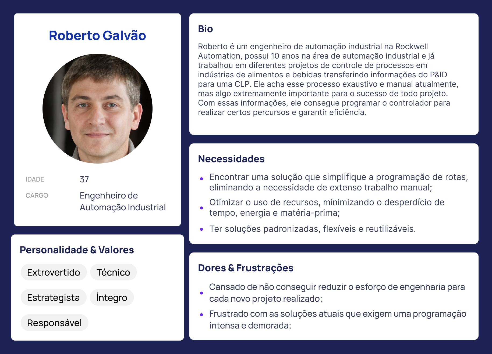

<table>
<tr>
<td>
<a href= "https://www.rockwellautomation.com/pt-br.html"></a>
</td>
<td><a href= "https://www.inteli.edu.br/"></a>
</td>
</tr>
</table>

<font size="+12"><center>
Constelação
</center></font>

**Conteúdo**

- [Entendimento do Contexto do Problema](#entendimento-do-contexto-do-problema)
- [Entendimento da Experiência do Usuário](#entendimento-da-experiência-do-usuário)
- [Entendimento do Negócio](#entendimento-do-negócio)
- [Testes Backend](#testes-backend)

# Entendimento do contexto do problema

## Descrição da solução a ser desenvolvida

### a) Qual é o problema a ser resolvido?

O problema a ser resolvido diz respeito à automação de rotas industriais. Atualmente, há um grande esforço para definir qual a melhor rota para cada fluxo de indústria que procura a Rockwell Automation. Além disso, as soluções criadas são pouco flexíveis, pois se precisar criar uma rota nova ou alterar uma já existente, terá que alterar todo o código do Controlador lógico programável (PLC).

### b) Qual a solução proposta?

Pretendemos entregar um algoritmo baseado em grafos que receberá os dados da planta da indústria e entregará qual a melhor rota, assim como todo o fluxo possível, de forma simplificada.
Essa proposta de solução é modular e flexível para a definição de rotas otimizadas, utilizando a modelagem em grafos. Essa solução visa padronizar e otimizar a definição de rotas, reduzindo o esforço de engenharia para cada novo projeto.

### c) Como a solução proposta deverá ser utilizada?

O engenheiro colocará os dados da planta da indústria em formato CSV, especificando a quantidade de tanques, os pesos de cada rota e etc. Logo em seguida, ele receberá tanto o modelo simplificado das rotas e também o melhor caminho.

### d) Quais os benefícios trazidos pela solução proposta?

Os engenheiros não precisarão mais passar horas projetando o melhor caminho para cada rota das indústrias que procuram a automação da Rockwell. Isso aumenta a eficiência na definição de rotas e, consequentemente, otimiza a produção.

### e) Qual será o critério de sucesso e qual medida será utilizada para o avaliar?

O sucesso será medido de acordo com as soluções já existentes. Se o algoritmo apresentar a mesma solução ou uma melhor, reconheceremos o nosso algoritmo como bem sucedido. Essa validação envolverá a participação dos engenheiros e a aplicação na própria fábrica, para verificar a eficácia da solução.

## Modelagem e representação

### 1- a) Qual o contexto do problema a ser resolvido?

A Rockwell Automation entregou um desafio relacionado à automação de rotas industriais com um exemplo de rotas para uma cervejaria, especificamente no controle e otimização de rotas entre tanques de fermentação e maturação. Cervejarias industriais, em específico, possuem muitos tanques, o que aumenta a complexidade das rotas entre eles e requer um controle mais elaborado.

Dessa forma, considerando o mapa da cervejaria que recebemos, o problema é dividido em duas etapas:

1- Entender a representação de todas as rotas, transformando-a em grafos.

2- Definir qual a melhor rota, considerando o peso de cada aresta e a quantidade de nós.

### b) Quais os dados disponíveis?

Temos um mapa, que representa todas as conexões e rotas existentes dentro da cervejaria. Dentre as informações disponíveis, essas são as principais:

1. Informações sobre a distribuição de tanques, válvulas, conexões e tubulações.
2. Regras de origem e destino das rotas.
3. P&ID (Pipe and Instruments diagram) de exemplo de uma cervejaria moderna.
4. Informações sobre a capacidade, tamanho e número de tanques de fermentação e maturação.
<br>Para elaborar o modelo, nós usaremos os seguintes dados:
<br>Distância entre os nós (peso das arestas);
<br>Inicial de cada nó que pode representar Worth1, Worth2, GreenBeer1, GreenBeer2, Filtration1, Filtration2, Tanques, Válvulas Mixproofs, Válvulas Solenoides;
<br>Disponibilidade de cada nó.

### c) Qual o objetivo do problema?

O principal objetivo é desenvolver uma solução modular e flexível para definir rotas otimizadas em indústrias, usando uma modelagem de grafos. Neste caso, estamos levando em consideração as rotas para fabricação de cervejas. Esta solução busca reduzir o esforço de engenharia para cada novo projeto, permitindo uma padronização, flexibilidade e reutilização do mesmo programa, para outras empresas que procurem a Rockwell Automation com um problema parecido.

A modelagem matemática do objetivo representa o mínimo caminho entre o mosto de maturação e a filtração final da cerveja:

$$
Min \ C = 2\cdot X_{W_{1}V_{M1}} + 4\cdot X_{W_{1}V_{S1}}+3\cdot X_{V_{S1}V_{M2}}
+5\cdot X_{V_{M2}V_{M4}}+7\cdot X_{V_{M2}V_{M3}}+2\cdot X_{V_{M3}V_{M4}}
+1\cdot X_{V_{M4}V_{M6}}+3\cdot X_{V_{M4}V_{M5}}
$$
$$
+3\cdot X_{V_{M6}V_{M7}}
+2\cdot X_{V_{M5}V_{M7}}+2\cdot X_{V_{M7}F_{1}}
$$


**A modelagem acima foi baseada no seguinte caminho, atribuindo um peso aleatório nas arestas:**


### d) Qual a tomada de decisão do problema proposto (ou seja, quais as variáveis de decisão consideradas)?

## Variáveis de decisão:

Tendo em vista que temos um Problema do Caminho Mínimo (PCM), para mostrar o conjunto de equações usamos:


## e) Pelo menos 1 limitação existente no problema:
 
**Considere**


### Modelagem matemática das limitações:


### 2- a) A representação visual (usando o Neo4J) dos nós e arestas, na localização referente ao projeto

### Representação Gráfica

#### Grafo do Projeto


### Legenda das cores representadas nos nós do grafo

1. Worth1 - Azul
2. Worth2 - Azul
3. GreenBeer1 - Verde
4. GreenBeer2 - Verde
5. Filtration1 - Marrom
6. Filtration2 - Marrom
7. Tanques - Amarelo
8. Válvulas Mixproofs - Laranja
9. Válvulas Solenoides - Rosa

### b) A indicação de uma solução (caminho) factível/viável


#### Essa seção descreve o processo detalhado para a produção de cerveja, desde o mosto até a etapa final de filtração. A produção é dividida em passos sequenciais, cada um representando uma etapa fundamental no processo. (Obs: Essa é uma representação de grafo simplificada para facilitar entendimento)

##### Passo 1: Mosto para fermentação

Nesta fase inicial, são executadas as seguintes etapas:

Transferência do "Worth1" para a válvula "Vm1Worth1".
Transferência de "Vm1Worth1" para a válvula "Vs1Worth1".
Transferência de "Vs1Worth1" para a válvula "Vm2Worth1".
Transferência de "Vm2Worth1" para a válvula "VmCCT1".
Transferência de "VmCCT1" para o tanque "CCT1".
Realização da fermentação.

##### Passo 2: Centrifugação da Green Beer

Nesta etapa, a Green Beer é processada da seguinte forma:

Transferência do tanque "CCT1" para a válvula "vmCCT1".
Transferência da válvula "vmCCT1" para a válvula "vm2worth1".
Transferência da válvula "vm2worth1" para a válvula "Vm1GreenBeer".
Transferência da válvula "Vm1GreenBeer" para a centrifugação no nó GreenBeer1.

##### Passo 3: Maturação e Filtração do Mosto Verde

O mosto verde centrifugado passa por um processo de maturação e filtração:

Transferência da Green Beer centrifugada para a válvula "Vm2GreenBeer".
Transferência da válvula "Vm2GreenBeer" para a válvula "Vm3Worth1".
Transferência da válvula "Vm3Worth1" para a válvula "VmCCT16".
Transferência da válvula "VmCCT16" para o tanque "CCT16".
Realização do processo de maturação.

##### Passo 4: Filtração Final da Cerveja

Nesta etapa final, a cerveja é submetida a um processo de filtração:

Transferência do tanque "CCT16" para a válvula "VmCCT16".
Transferência da válvula "VmCCT16" para a válvula "Vm3Worth1".
Transferência da válvula "Vm3Worth1" para a válvula "Vm2GreenBeer".
Transferência da válvula "Vm2GreenBeer" para a válvula "Vm2Filtration".
Transferência da válvula "Vm2Filtration" para a válvula "Vm1Filtration".
Transferência da válvula "Vm2Filtration" para Filtration.
Realização do processo de filtração no nó de Filtration.

# Entendimento da Experiência do Usuário

O Entendimento da Experiência do Usuário é um passo importante para entender a relação do usuário com a nossa ferramenta. As análises feitas abaixo podem ser encontradas em nosso reposítorio no Figma <https://www.figma.com/team_invite/redeem/ipiO0UDpH8P83BNxYOP1br>.

## Persona

Nas personas, desenvolvemos um perfil detalhado do usuário-chave do projeto, o Engenheiro de Automação Industrial, considerando suas experiências, necessidades, dores e frustrações. Essa persona permite uma compreensão mais profunda das expectativas e prioridades desse usuário em relação à solução de otimização de rotas com modelagem em grafos. Essas personas fornecem uma base sólida para orientar o design, o desenvolvimento e a tomada de decisões ao longo do projeto, garantindo que a solução seja verdadeiramente centrada no usuário.



## User Stories

Já nas user stories, definimos de maneira concisa e estruturada os requisitos funcionais e as necessidades específicas do Engenheiro de Automação Industrial, nossa Persona, em relação à solução. Em um total de dez, cada história capturou uma ação desejada, o motivo por trás dela e como contribuiria para as metas do usuário. Ao seguir o método INVEST, as user stories foram moldadas para serem independentes, negociáveis, valiosas, estimáveis, pequenas e testáveis, o que torna a tradução dos requisitos de usuário em tarefas de desenvolvimento mais eficiente e bem-sucedida. Essa nossa criação das user stories oferece um guia detalhado, garantindo a entrega de uma solução que atenda diretamente às necessidades e expectativas do usuário, promovendo uma melhor experiência pro usuário e o sucesso do projeto como um todo.


# Entendimento do Negócio

## Contexto da Indústria

A Rockwell Automation é líder mundial em automação industrial e transformação digital, com sede em Milwaukee, Wisconsin, EUA. A empresa atua no Brasil desde 1983, desde então, a empresa expandiu suas operações, construiu parcerias estratégicas e desenvolveu uma sólida base de clientes em diversos setores industriais brasileiros. Com um histórico de inovação e domínio no setor, a Rockwell Automation se destaca como uma referência em soluções de automação industrial em todo o mundo.

O modelo de negócio da Rockwell Automation se baseia na oferta de soluções de automação industrial e tecnologia da informação para uma ampla gama de setores e abrange uma grande variedade de produtos como controladores programáveis, sistemas de controle, software de automação, redes industriais, sensores, motores e drives. Além disso, a empresa oferece serviços de consultoria, suporte técnico e serviços de gerenciamento de ativos para ajudar seus clientes a otimizar suas operações industriais e a adotar tecnologias de automação mais avançadas.

O mercado de automação industrial é altamente competitivo, com vários competidores de renome global. Segundo relatórios da empresa Mordor Intelligence sobre o mercado de automação industrial, os principais competidores da Rockwell Automation no mercado são: Siemens AG, Schneider Electric e Mitsubishi Electric. A Siemens é uma empresa alemã de tecnologia industrial, que fornece produtos e soluções para automação, energia e tecnologia de mobilidade. A Schneider Electric é uma empresa francesa que oferece soluções e serviços de gestão de energia e automação para diversos setores industriais. Mitsubishi Electric é uma empresa japonesa conhecida por suas soluções em automação industrial, incluindo robôs, controladores e equipamentos elétricos. Diante desse cenário competitivo, a Rockwell Automation precisa continuar investindo em sua capacidade inovadora e adaptativa, buscando aprimorar constantemente seu portfólio de soluções.

A automação industrial tem passado por avanços notáveis ​​nos últimos anos, os quais estão moldando o cenário das atividades de fabricação e dos processos produtivos que vislumbramos para o futuro. Uma análise divulgada pela Rockwell Automation revela que automação, digitalização, sustentabilidade e produtividade são os pilares essenciais para o mercado industrial em 2023. A Siemens, por sua vez, afirma que o grande destaque do ano de 2023 será a consolidação da transformação digital. Nas palavras de Pablo Fava, CEO da Siemens Brasil, a empresa está firmemente empenhada em consolidar essa transformação digital em um ambiente de crescente busca por eficiência nos processos. Por essa razão, a Siemens identifica cinco tendências tecnológicas desenvolvidas para o ano: Gêmeo Digital, Metaverso Industrial, 5G Industrial, Plataformas "As a Service" e Cibersegurança. Além disso, a ênfase cada vez maior na sustentabilidade impulsiona a busca por soluções de automação que sejam energeticamente eficientes e ecologicamente amigáveis ao meio ambiente. Isso se alinha a uma visão global de produção mais responsável e sustentável. Nesse contexto, o mercado de automação industrial está na vanguarda da quarta revolução industrial, elevando os padrões de eficiência e produtividade e estabelecendo novos parâmetros para o futuro industrial. Tudo isso é respaldado por uma integração harmoniosa entre seres humanos e máquinas, que se torna um pilar central nesse cenário de evolução.

## 5 Forças de Porter

Poder de barganha dos compradores: O poder de barganha dos compradores é alto, pois o mercado de automação industrial é altamente competitivo e inclui muitos players, oferecendo uma ampla gama de produtos e soluções. Segundo a Mordor Intelligence, o mercado de automação fabril e controle industrial é caracterizada por uma intensa concorrência e engloba diversos protagonistas de renome. O cenário de mercado demonstra um grau de fragmentação moderado. Dado o exposto, os compradores têm acesso a várias alternativas de fornecedores, o que lhes dá uma posição de negociação mais forte. Eles podem comparar preços, recursos e serviços oferecidos por diferentes empresas, o que aumenta a pressão sobre os preços e os termos de contrato.

Rivalidade entre concorrentes: A rivalidade entre concorrentes é de média a alta, pois o mercado de automação industrial é composta por várias empresas de renome, incluindo concorrentes diretos da Rockwell Automation. Essa concorrência pode levar a batalhas de preços e ações agressivas para conquistar a participação de mercado. De acordo com a empresa Mordor Intelligence, os principais players do mercado estão aproveitando iniciativas de colaboração para aumentar suas participações de mercado e lucratividade, um exemplo disso, é a parceria entre a Siemens e o Google Cloud para um projeto de otimização de operações de produção e aumentar a eficiência do chão de fábrica. Portanto, a diferenciação de produtos e a busca por inovação são cruciais para se destacar na competição.

Ameaça de novos entrantes: A ameaça de novos entrantes é classificada como moderada, pois a entrada no mercado de automação industrial requer investimentos em P&D, infraestrutura e conhecimento técnico. Conforme a Mordor Intelligence, os investimentos em tecnologias de automação para esses dispositivos do mercado de automação industrial envolvem despesas significativas de capital, com projetos, fabricação e instalação de sistemas integrados frequentemente custando milhões de dólares. Por isso, embora a ameaça de novos entrantes não seja desprezível, a complexidade técnica e os requisitos de capital para competir em um nível significativo são barreiras à entrada de novos competidores.

Poder de barganha dos fornecedores: O poder de barganha dos fornecedores é de moderado a baixo porque embora o mercado de automação exija insumos de alta qualidade e tecnologia avançada, os fornecedores são clientes da competição acirrada entre as empresas de automação. Isso reduz a capacidade dos fornecedores de ditar preços e termos, gerando um nível moderado a baixo de poder de barganha.

Ameaça de produtos ou serviços substitutos: A ameaça de produtos ou serviços substitutos tem um nível moderado, pois embora a automação industrial seja essencial para muitas operações, existem certos cenários em que processos manuais podem ser preferidos. Além disso, com o avanço tecnológico constante, é possível que soluções inovadoras ou novas abordagens de automação possam surgir, representando uma ameaça moderada para os produtos da Rockwell Automation.

## Matriz de Riscos


## Explicação de cada item em ameaças

### Item 1

Probabilidade: 50%

Impacto: 70%

**A ferramenta não atende às expectativas de funcionalidade ou desempenho:** Existe a possibilidade de o desenvolvimento da ferramenta não atender às expectativas de funcionalidade ou desempenho.

### Item 2

Probabilidade: 30%

Impacto: 50%

**A solução não se integra bem com os sistemas existentes:** A solução proposta pode não se integrar bem com os sistemas existentes, requerendo esforços adicionais ou modificações.

Classificação na Matriz: Alto

### Item 3

Probabilidade: 50%

Impacto: 50%

**A ferramenta é complexa e exige um treinamento extenso para os engenheiros:** A ferramenta pode ser complexa e exigir um treinamento extenso para os usuários finais.

Classificação na Matriz: Médio

### Item 4

Probabilidade: 70%

Impacto: 70%

**Os engenheiros resistem à adoção da nova ferramenta por encontrarem dificuldades no uso:** Os usuários finais podem resistir à adoção da nova ferramenta ou encontrar dificuldades no uso.

Classificação na Matriz: Alto

## Explicação de cada item em oportunidades

### Item 1

Probabilidade: 70%

Impacto: 50%

**Reduzir o tempo de produção, ao otimizar as rotas de transferência:** Com a implementação do projeto, existe a possibilidade de reduzir o tempo de produção ao otimizar as rotas de transferência, o que pode resultar em maior eficiência e produção.

Probabilidade: 70%. Há uma boa chance de conseguir otimizar o tempo, considerando a flexibilidade que a solução entregará.

Impacto: 50%. O impacto na produção total pode ser significativo, mas pode variar dependendo da capacidade atual da fábrica.

### Item 2

Probabilidade: 50%

Impacto: 70%

**Reduzir erros devido à intervenção humana, eliminando os custos associados a esses erros:** A automação das rotas pode reduzir erros devido à intervenção humana, o que consequentemente pode diminuir os custos associados a esses erros.

Probabilidade: 50%. Depende da taxa atual de erros humanos e quão eficiente será a solução.

Impacto: 70%. Os custos associados a erros humanos podem ser altos, porque são processos contínuos de produção.

### Item 3

Probabilidade: 30%

Impacto: 90%

**Aumentar a capacidade de produção sem a necessidade de adicionar mais equipamentos:** Ao otimizar as rotas e tornar o processo mais eficiente, pode ser possível aumentar a capacidade de produção sem a necessidade de adicionar mais equipamentos.

Probabilidade: 30%. Depende do quão otimizado já está o sistema atual e do potencial de melhoria trazido pela nova solução.

Impacto: 90%. Aumentar a capacidade de produção sem grandes investimentos em equipamento pode ter um impacto muito positivo nos lucros.

### Item 4

Probabilidade: 50%

Impacto: 30%

**A implementação inovadora pode servir como marketing, tornando a Rockwell Automation uma referência e pioneira no setor:** A implementação de uma solução inovadora pode ser usada como uma ferramenta de marketing e branding, destacando a Rockwell Automation como líder e inovadora no setor.

Probabilidade: 50%. A eficácia desta estratégia dependerá da resposta do mercado e da maneira como é comunicada.

Impacto: 30%. Embora positivo, o impacto pode ser mais indireto, fortalecendo a marca a longo prazo.

### Item 5

Probabilidade: 90%

Impacto: 70%

**Existe a possibilidade de adaptação para outras indústrias ou processos, abrindo novos mercados para a empresa:** Ao desenvolver uma solução modular e flexível, existe a possibilidade de adaptá-la para outras indústrias ou processos, abrindo novos mercados para a empresa.

Probabilidade: 10%. A adaptação para outras indústrias pode requerer pesquisas e desenvolvimentos adicionais, entretanto, como essa é a proposta da Rockwell Automation, há uma grande probalidade de isso ocorrer.

Impacto: 70%. Entrar em novos mercados pode trazer novas fontes de receita e diversificar o portfólio da empresa.

## Análise SWOT

A análise SWOT da Rockwell Automation destaca sua posição de liderança, desempenho financeiro sólido e ênfase em inovação. Embora tenha complexidade na cadeia de suprimentos e dependência de componentes como fraquezas, a empresa se encontra bem posicionada para capitalizar oportunidades de expansão de mercado e desenvolvimento sustentável. No entanto, ela enfrenta desafios de concorrência intensa e risco cibernético. Com essas percepções, a Rockwell Automation está preparada para desenvolver estratégias que ampliam suas vantagens competitivas e abordam áreas de melhoria, sustentando seu sucesso contínuo na indústria de automação.


## Value Proposition Canvas

Nosso Value Proposition Canvas destaca como nossa solução a automação de rotas para a Rockwell Automation. Nossa visão é fornecer uma abordagem padronizada e flexível que agiliza a definição de rotas, gerando resultados práticos em cada projeto de automação. Estamos comprometidos em trazer maior praticidade e valor para a parceria com a Rockwell Automation.


# Testes Backend

## GET do Usuário


## POST Create do Usuário


<!--
## Update do Usuário

-->

## Delete do Usuário


## GET do nó


## Create do nó


<!--
## PUT do nó

-->

## Delete do nó

<!--
### Criando um nó para testar o Delete

-->

### Visualização do nó criado no Neo4j


<!--
### Delete do nó

-->

### Verificando o delete no Neo4j


## Create de arestas
### Visualizando os nós onde vamos colocar as arestas

### Criando as arestas via postman

### Vizualizando a criação das arestas no Neo4j


## Delete de arestas
### Visualizando as arestas que vamos deletar

### Deletando via postman

### Visualizando os nós sem as arestas no Neo4j


# Análise da Complexidade e Corretude do Algoritmo
## Qual o algoritmo implementado e por qual motivo escolhemos ele?
Antes de iniciarmos a análise da complexidade e da corretude do algoritmo, devemos entender o algoritmo que escolhemos e por qual motivo o escolhemos.

Analisamos os P&ID's disponibilizados e concluímos que a planta de uma fábrica é projetada para que haja poucos caminhos entre dois tanques que fazem sentido para a etapa de fabricação de um produto. Isso ocorre para evitar desperdício com caminhos desnecessários entre dois nós que devem ser conectados. 

Além disso, o menor caminho entre esses dois tanques não é necessariamente o melhor, pois dependendo das regras de fabricação de um produto, ainda que esse caminho seja curto com relação a todos os outros, ele não é viável.

Dessa forma, entendemos que o engenheiro responsável pela programação do CLP também deve escolher o melhor caminho entre dois tanques, dados todas as possibilidades existentes.

Entretanto, considerando que existem poucos caminhos possíveis entre dois tanques que devem ser conectados, o algoritmo deve fazer essa busca em pouco tempo.

Portanto, escolhemos o algoritmo de backtracking, já que ele é uma abordagem útil para encontrar todos os caminhos possíveis entre dois nós em um grafo, especialmente quando esses caminhos são poucos. 

Esse é o método mais simples e direto para encontrar todos os caminhos entre dois pontos. Ele começa no nó inicial e explora cada ramo antes de voltar atrás, caso não seja o caminho certo, funcionando por tentativa e erro.
## Melhor caso e pior caso
### Melhor caso:
O melhor caso ocorre quando não há nenhum caminho do nó de partida ao nó de destino. Nessa situação, o algoritmo realiza o mínimo de trabalho possível: ele simplesmente rastreia os nós até atingir um ponto morto (um nó sem saídas não visitadas) e retorna. Esse cenário também ocorrerá se o nó de partida e o nó de destino forem o mesmo e não houver auto-ciclos no grafo.

### Pior caso:
O pior caso ocorre quando todos os possíveis caminhos entre o nó de partida e o nó de destino precisam ser explorados. Especificamente, isso acontecerá em um grafo densamente conectado onde cada nó (exceto o destino) tem arestas para todos os outros nós. Em termos de operações, isso significa que o algoritmo teria que explorar cada possível combinação de nós entre o nó de partida e o nó de destino.

## Análise Matemática da Complexidade
### Melhor caso:

Como discutido, o melhor caso ocorre quando não há nenhum caminho do nó de partida ao nó de destino. A complexidade neste caso seria proporcional ao número de vértices que o algoritmo precisa visitar até atingir o nó sem saídas não visitadas, o que é no máximo V. Assim, a complexidade no melhor caso é:
$$ \Omega (V)$$

### Pior caso:

No pior caso, o algoritmo de backtracking teria que explorar cada combinação possível de nós. Para um grafo densamente conectado, isso seria próximo do fatorial do número de vértices, ou V!.

No entanto, isso é uma estimativa superior muito grosseira. Em termos práticos, a complexidade exata pode variar dependendo da estrutura exata do grafo e da posição relativa dos nós de partida e destino. No entanto, para fins de análise, podemos usar essa estimativa superior:

$$O(V!)$$

Deve-se notar que o fatorial cresce extremamente rápido, e mesmo para valores relativamente pequenos de V, V! é um número muito grande. Assim, o backtracking pode ser impraticável para grafos grandes hiperconectados. Entretanto, como podemos deduzir que a maioria dos caminhos não precisará ser explorada, consideramos que o algoritmo é eficiente.

 ## Invariante do Laço Principal

 ### Qual o laço principal do algoritmo?
 Para analisarmos a corretude do laço principal do algoritmo, primeiro devemos identificá-lo. Dessa forma, analisando o nosso código implementado, entendemos que o laço principal do algoritmo é o laço `for` dentro da função `findAllPathsUtil`. Esse laço itera através de todos os vértices adjacentes ao vértice atual "u":
 ```
  for (Integer i : adj.get(u)) {
    if (!visited[i]) {
        findAllPathsUtil(i, d, visited, localPathList);
    }
} 
```
O propósito desse laço é explorar todos os vértices adjacentes não visitados ao vértice atual e, para cada um deles, fazer uma chamada recursiva a `findAllPathsUtil`.

 ### Pseudocódigo do laço principal
 A fim de entender o funcionamento do laço principal do algoritmo, este é o seu pseudocódigo:
```
 PARA CADA vértice i em adjacência do vértice u FAÇA:
    SE i NÃO FOI visitado ENTÃO
        Chame findAllPathsUtil com (i, d, visited, localPathList)
    FIM DO SE
FIM DO PARA
```
### Invariante do laço principal expresso em fórmula matemática

Considerando que $ \text{adj}(u) $ é o conjunto de vértices adjacentes a $ u $ e que $ \text{visited}[i] $ é um indicador de se o vértice $ i $ foi visitado ou não (sendo verdadeiro se visitado e falso caso contrário), a invariante $ I $ pode ser expressa da seguinte forma:

 $ I: \forall i \in \text{adj}(u) \setminus \text{conjunto já iterado} \Rightarrow \text{visited}[i] = \text{falso} $

Essa invariante afirma que para todos os vértices $ i $ que são adjacentes a $ u $ e ainda não foram processados (ou seja, que ainda não passaram pela iteração atual do laço), o vértice $ i $ não foi visitado. Em outras palavras, somente os vértices que já passaram pela iteração atual podem ter sido visitados, e todos os outros (ainda não processados) permanecem como não visitados.

### Justificativa da Invariante do Laço

A asserção $I$ deve ser verdadeira antes de começar o laço. E se o código estiver correto, deve permanecer após o término do laço. Como não podemos saber exatamente quando o laço vai terminar, essa asserção deve permanecer verdadeira a cada iteração (o que já inclui a iteração final). Além disso, embora os valores propriamente ditos dessa asserção possam ser modificados, a relação de suas variáveis não pode ser afetada em cada iteração.

Dessa forma, esta é a análise de cada uma das etapas descritas anteriormente:

**Antes do laço começar:** 
Antes da primeira iteração do laço, o "conjunto já iterado" está vazio, ou seja, nenhum vértice adjacente a $u$ foi processado. Neste ponto, nenhum desses vértices foi visitado, então a invariante é verdadeira.

**Durante cada iteração:**

- Se o vértice $i$ já foi visitado, o laço simplesmente prossegue para a próxima iteração sem alterar o estado de visitação do vértice $i$.
- Se o vértice $i$ não foi visitado, então a função `findAllPathsUtil` é chamada. Depois de visitar o vértice $i$ e potencialmente outros vértices que ele pode alcançar, o vértice $i$ é adicionado ao "conjunto já iterado".
- O ponto crucial aqui é que a função `findAllPathsUtil` não visitará nenhum dos vértices que ainda não foram processados na iteração atual do laço. Isso porque a função apenas visita vértices não visitados, e de acordo com nossa invariante, todos os vértices que ainda não foram processados no laço não foram visitados.

**Após cada iteração:** 
Uma vez que um vértice é processado pelo laço, ele é essencialmente adicionado ao "conjunto já iterado". Como ele já foi processado, não importa se foi visitado ou não nas próximas iterações.

Portanto, ao considerar esses três pontos, pode-se concluir que a asserção $I$ é mantida em todas as iterações do laço, tornando-a uma invariante válida para esse laço `for`.


### Prova da invariante do laço principal, pelo princípio da indução finita

**Passo básico de indução:**
Antes da primeira iteração, o "conjunto já iterado" está vazio. Portanto, todos os vértices em $ \text{adj}(u) $ ainda não foram processados. Neste ponto, todos os vértices adjacentes a $ u $ não foram visitados, então $ \text{visited}[i] = \text{falso} $ para todos $ i \in \text{adj}(u) $. Assim, a invariante $ I $ é válida antes da primeira iteração.

**Hipótese de Indução:**
Assumimos que a invariante $ I $ é válida no início da k-ésima iteração:

$ I(k): \forall i \in \text{adj}(u) \setminus \text{conjunto já iterado até a } k\text{-ésima iteração} \Rightarrow \text{visited}[i] = \text{falso} $

**Passo de Indução:**
Precisamos mostrar que $ I $ também é válida no início da (k+1)-ésima iteração.

Durante a k-ésima iteração, o vértice $ i_k $ é processado. Se $ i_k $ já foi visitado anteriormente, o laço não faz nada e passa para a próxima iteração, mantendo a validade da invariante.

Se $ i_k $ não foi visitado, a função `findAllPathsUtil` é chamada, que marcará $ i_k $ como visitado e, eventualmente, todos os outros vértices que ele pode alcançar. Importante notar que esses vértices visitados não estão em $ \text{adj}(u) \setminus \text{conjunto já iterado} $ no momento da k-ésima iteração, pois só estamos considerando vértices diretamente adjacentes a $ u $. Assim, a validade da invariante não é comprometida por chamar a função `findAllPathsUtil`.

No final da k-ésima iteração, $ i_k $ é adicionado ao "conjunto já iterado". Então, no início da (k+1)-ésima iteração, a invariante $ I $ ainda é válida, pois $ \text{visited}[i] = \text{falso} $ para todos $ i \in \text{adj}(u) \setminus \text{conjunto já iterado} $.

Dessa forma, provamos que a invariante do laço $I$ é válida para todas as iterações do laço.


 # Referências

ROCKWELL AUTOMATION. Sobre nós. Disponível em: < <https://www.rockwellautomation.com/en-us/company/about-us.html>> . Acesso em: 05 ago. 2023.

MUNDO DA AUTOMAÇÃO. Rockwell Automação. Disponível em: < <https://www.automationworld.com/home/company/13305775/rockwell-automation>> . Acesso em: 05 ago. 2023.

TN PETRÓLEO. A Rockwell Automation figura entre as mais éticas do mundo. Disponível em: < <https://tnpetroleo.com.br/noticia/rockwell-automation-figura-entre-as-mais-eticas-do-mundo/>> . Acesso em: 05 ago. 2023.

MORDOR INTELIGÊNCIA. Relatório de mercado: Mercado de acionamentos elétricos na América do Norte. Disponível em: < <https://www.mordorintelligence.com/industry-reports/north-america-electric-drives-market/companies>> . Acesso em: 06 ago. 2023.

MORDOR INTELIGÊNCIA. Relatório de mercado: Mercado de controladores lógicos programáveis ​​(CLPs) na Europa. Disponível em: < <https://www.mordorintelligence.com/pt/industry-reports/europe-programmable-logic-controller-plc-market>> . Acesso em: 06 ago. 2023.

MORDOR INTELIGÊNCIA. Relatório de mercado: Mercado global de automação de fábricas e controles industriais. Disponível em: < <https://www.mordorintelligence.com/pt/industry-reports/global-factory-automation-and-industrial-controls-market-industry>> . Acesso em: 06 ago. 2023.

RESEARCHANDMARKETS.COM. Relatório Global do Mercado de Acionamentos de Corrente Alternada (CA) até 2031: Apresentando ABB, Danfoss, Siemens, Mitsubishi Electric e Schneider Electric, entre outros. Disponível em: < <https://www.businesswire.com/news/home/20230504005595/en/Global-Alternate-Current-AC-Drives-Market-Report-to-2031-Featuring-ABB-Danfoss-Siemens-Mitsubishi-> Electric-and-Schneider-Electric-Entre-Outros---ResearchAndMarkets.com> . Acesso em: 06 ago. 2023.

ROCKWELL AUTOMATION. As principais tendências para o mercado industrial em 2023. Disponível em: < <https://www.rockwellautomation.com/pt-br/company/news/press-releases/as-principais-tendencias-para-o-mercado-industrial-> em-2023.html> . Acesso em: 07 ago. 2023.

AUTOMAÇÃO INDUSTRIAL. Siemens aponta cinco tendências de tecnologia para 2023. Disponível em: < <https://www.automacaoindustrial.info/siemens-aponta-cinco-tendencias-de-tecnologia-para-2023/>> . Acesso em: 07 ago. 2023.


